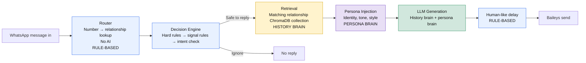

# WhatsApp Persona Agent

A retrieval-grounded WhatsApp persona agent that uses a private conversation history and persona profile to generate context-aware replies. It is not a general chatbot: messages pass through relationship routing, safety rules, retrieval, persona injection, and controlled reply generation.

> **Important:** Keep real chat exports, phone numbers, API keys, authentication files, logs, databases, and generated persona data local.

## Architecture



## Requirements

- Windows, macOS, or Linux
- Python 3.10+
- Node.js and npm
- A local ChromaDB server
- A Google Gemini API key
- A dedicated secondary WhatsApp number

## 1. Clone and enter the repository

```powershell
git clone <repository-url>
cd Whatsapp_Ai
```

Create a Python virtual environment:

```powershell
python -m venv .venv
.\.venv\Scripts\Activate.ps1
```

On macOS/Linux:

```bash
python3 -m venv .venv
source .venv/bin/activate
```

## 2. Install Python dependencies

```powershell
python -m pip install --upgrade pip
python -m pip install chromadb sentence-transformers google-genai python-dotenv flask streamlit streamlit-autorefresh pytest
```

## 3. Install Node.js dependencies

```powershell
npm install
```

If the package is not already listed:

```powershell
npm install @whiskeysockets/baileys axios qrcode-terminal
```

Never commit:

```text
node_modules/
auth_info_baileys/
```

## 4. Configure environment variables

Create `.env` in the repository root:

```dotenv
GEMINI_API_KEY=your_gemini_api_key_here
GEMINI_MODEL=gemini-3.5-flash
```

Never commit `.env`.

Verify that the key is available without printing it:

```powershell
python -c "from dotenv import load_dotenv; import os; load_dotenv(); print('GEMINI_API_KEY configured:', bool(os.getenv('GEMINI_API_KEY')))"
```

## 5. Prepare the WhatsApp export

Export chats manually from WhatsApp:

1. Open WhatsApp on your phone.
2. Open the required one-to-one chat.
3. Open the chat menu.
4. Select **More**.
5. Select **Export chat**.
6. Choose **Without media**.
7. Save the exported `.txt` file locally.

Place exports in:

```text
data/raw_export/
```

Example:

```text
data/raw_export/chatGau.txt
data/raw_export/chatKru.txt
```

Do not commit this directory. It contains private conversation data.

## 6. Configure the parser

Inspect the exact sender name used in the exported chat:

```powershell
Get-Content data\raw_export\chatGau.txt -TotalCount 20
```

Run the parser using the exact name that represents your own messages:

```powershell
python -m ingestion.parse_export --name "Your Name"
```

Validate the generated pairs:

```powershell
python ingestion\validate_pairs.py
```

The generated files remain local:

```text
data/processed_pairs.jsonl
data/processed_pairs/
```

## 7. Build the relationship map

Generate or update the local relationship map:

```powershell
python ingestion\build_relationship_map.py
```

Open:

```text
config/relationship_map.json
```

Replace every `REPLACE_ME` value manually with one of:

```text
family
friend
professional
unknown
```

Validate it:

```powershell
python agent\validate_relationship_map.py
```

The real relationship map may contain phone numbers and must not be committed. Use the sanitized example file for GitHub:

```text
config/relationship_map_example.json
```

## 8. Create the persona profile

Keep the real persona file local:

```text
persona/persona.json
```

Validate it:

```powershell
python -m json.tool persona\persona.json
```

If required, rebuild persona statistics from local data:

```powershell
python persona\build_persona.py
```

Do not commit personal persona data or generated style files.

## 9. Start ChromaDB and build embeddings

Check port `8000`:

```powershell
Get-NetTCPConnection -LocalPort 8000 -ErrorAction SilentlyContinue
```

Start ChromaDB in its own terminal:

```powershell
chroma run --path .\chroma_data --port 8000
```

In another terminal, generate embeddings:

```powershell
python ingestion\embed_to_chroma.py
```

This downloads the multilingual sentence-transformers model on first use and stores the local ChromaDB data under:

```text
chroma_data/
```

The database and downloaded model files must not be committed.

Test retrieval:

```powershell
python -m ingestion.retrieval_demo
```

## 10. Configure runtime settings

Create or update:

```text
config/settings.json
```

Recommended initial configuration:

```json
{
  "dry_run": true,
  "min_delay_seconds": 3,
  "max_delay_seconds": 12
}
```

Always begin every fresh session with:

```json
"dry_run": true
```

## 11. Start the Flask bridge

In a new terminal:

```powershell
python -m agent.bridge
```

The bridge runs on:

```text
http://localhost:5001
```

Check it by sending a test request:

```powershell
$body = @{
    jid = "000000000000@s.whatsapp.net"
    text = "Test message"
    message_type = "text"
    is_forwarded = $false
    from_me = $false
} | ConvertTo-Json

Invoke-RestMethod `
    -Uri "http://localhost:5001/process" `
    -Method Post `
    -ContentType "application/json" `
    -Body $body
```

## 12. Start the Streamlit console

In a new terminal:

```powershell
python -m streamlit run console\app.py
```

Open the displayed URL, normally:

```text
http://localhost:8501
```

The console displays:

- Recent processed messages
- Relationship badges
- Reply or ignore decisions
- Decision reasons
- Generated replies
- Retrieval traces
- Message and reply metrics
- Current runtime mode

## 13. Start the Baileys client

Before starting it, confirm the bridge is running and `dry_run` is enabled:

```powershell
Get-Content config\settings.json
```

Then run:

```powershell
node whatsapp\baileys_client.js
```

On first run:

1. A QR code appears in the terminal.
2. Open WhatsApp on the dedicated secondary phone.
3. Go to **Linked devices**.
4. Select **Link a device**.
5. Scan the terminal QR code.
6. Wait for the connection confirmation.

Authentication data is stored locally in:

```text
auth_info_baileys/
```

Do not commit this directory.

## 14. Normal startup order

Start each service in a separate terminal:

### Terminal 1: ChromaDB

```powershell
chroma run --path .\chroma_data --port 8000
```

### Terminal 2: Flask bridge

```powershell
python -m agent.bridge
```

### Terminal 3: Streamlit console

```powershell
python -m streamlit run console\app.py
```

### Terminal 4: Baileys client

```powershell
node whatsapp\baileys_client.js
```

Keep the Baileys client in `DRY_RUN` mode until all routing, retrieval, decision, and console behavior has been verified.

## 15. Console controls

### DRY_RUN/LIVE

Use the sidebar toggle:

- **DRY_RUN:** generates and logs replies but does not send them.
- **LIVE:** permits sending only after all safety checks pass.

Always start a fresh session in **DRY_RUN** mode.

### Delay settings

Configure:

- Minimum delay
- Maximum delay

Both values must be positive, and the minimum must be smaller than the maximum. The Baileys client reads these settings before processing each message.

### Kill switch

Click:

```text
🛑 KILL SWITCH
```

This creates:

```text
kill_switch.flag
```

When the flag exists, the Baileys client skips all message processing and does not call the bridge or send replies.

To resume processing, click:

```text
Clear kill switch
```

You can also remove it manually:

```powershell
Remove-Item .\kill_switch.flag -Force
```

## 16. Testing

Run router tests:

```powershell
python -m pytest agent\test_router.py
```

Validate the relationship map:

```powershell
python agent\validate_relationship_map.py
```

Run the batch decision test:

```powershell
python -m agent.batch_test
```

Check recent logs:

```powershell
Get-Content logs\decision_log.jsonl -Tail 10
Get-Content logs\console_feed.jsonl -Tail 10
```

## ⚠️ USE RESPONSIBLY

> **Baileys automates WhatsApp Web, which is against WhatsApp's Terms of Service.**
>
> - Run this only on a dedicated or secondary WhatsApp number.
> - Keep message volume low.
> - Use human-like delays.
> - Reply only to contacts who have explicitly consented.
> - Keep `DRY_RUN` enabled while testing.
> - Do not use this for bulk messaging, spam, harassment, or unsolicited outreach.
> - Aggressive or abusive use can cause the number to be banned.
> - Stop the system immediately with the kill switch if unexpected behavior occurs.
> - Keep chat exports, phone numbers, credentials, logs, model data, and authentication files private.

## Private files that must not be committed

```text
.env
data/
logs/
auth_info_baileys/
chroma_data/
node_modules/
config/settings.json
config/relationship_map.json
persona/persona.json
persona/style_signals_*.json
*.pdf
```