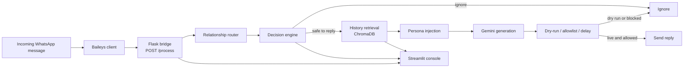

# WhatsApp Cruise Control

> A local-first, retrieval-grounded WhatsApp assistant that drafts relationship-aware replies in your writing style—with explicit safety gates, dry-run mode, human-like delays, and a live monitoring console.


## ⚠️ Read this first

This project automates WhatsApp Web through the Baileys library. Automation may violate WhatsApp's Terms of Service and can result in an account restriction or ban.

Use it only for responsible, consent-based experimentation:

- Use a dedicated secondary WhatsApp number.
- Start with `dry_run: true` and keep it enabled while testing.
- Never use it for spam, bulk messaging, harassment, or unsolicited outreach.
- Keep chat exports, phone numbers, API keys, authentication files, logs, and generated persona data private.
- Keep the kill switch available and stop the system immediately if it behaves unexpectedly.
- Do not rely on automatic replies for medical, legal, financial, emergency, or other sensitive conversations.

## What this project does

WhatsApp Cruise Control combines a Python decision and generation pipeline with a Node.js WhatsApp client. Incoming messages are routed through a local Flask bridge, classified by relationship and safety rules, matched against relevant conversation history, and optionally used to generate a reply with Google Gemini.

The project uses a **two-brain design**:

1. **Persona brain** — identity, tone, language habits, emoji usage, typical message length, and hard rules.
2. **History brain** — real message/reply pairs retrieved from relationship-specific ChromaDB collections.

This keeps general communication style separate from the specific things previously said to friends, family, or professional contacts.

## Key features

- Relationship-aware routing for `family`, `friend`, `professional`, `unknown`, and `group` conversations.
- Safety-first reply gates that can ignore own messages, groups, unknown senders, forwarded content, low-signal acknowledgements, media-only messages, and sensitive intents.
- Retrieval-Augmented Generation (RAG) using multilingual sentence-transformer embeddings and ChromaDB.
- Google Gemini-powered reply generation with persona and retrieved examples in the prompt.
- `DRY_RUN` mode that generates and logs replies without sending them.
- Independent allowlist verification immediately before a live send.
- Randomized response delays configured through the Streamlit console.
- Kill switch using `kill_switch.flag`.
- Flask `/process` bridge for communication between Baileys and the Python agent.
- Streamlit live console with decisions, reasons, replies, retrieval traces, and metrics.
- Local JSONL logs for decisions and console activity.

## Architecture



### Message flow

1. `whatsapp/baileys_client.js` receives a WhatsApp message and extracts its text, type, sender JID, and forwarded status.
2. The client sends the normalized payload to `http://localhost:5001/process`.
3. `agent/router.py` maps the sender's number to a relationship and corresponding history collection.
4. `agent/decision_engine.py` applies deterministic safety gates and a Gemini intent check. It fails closed when intent classification is unavailable or ambiguous.
5. `ingestion/retrieval.py` retrieves up to three similar messages from the matching ChromaDB collection.
6. `agent/generator.py` combines the persona, relationship tone, and retrieved examples to generate one WhatsApp-style reply.
7. The Node client either logs the reply in dry-run mode or verifies the allowlist, waits for the configured delay, and sends it.
8. `console/app.py` reads `logs/console_feed.jsonl` and refreshes the monitoring view every two seconds.

## Project structure

```text
.
├── agent/
│   ├── bridge.py                    Flask API bridge on port 5001
│   ├── decision_engine.py           Reply/ignore safety gates
│   ├── generator.py                 Gemini reply generation
│   ├── router.py                    JID → relationship routing
│   ├── batch_test.py                End-to-end decision smoke test
│   ├── validate_relationship_map.py Relationship-map validation
│   └── test_router.py               Router unit tests
├── config/
│   ├── constants.py                 Shared constants and acknowledgement words
│   ├── settings.py                  Runtime settings and allowlist helpers
│   ├── relationship_map_example.json Sanitized map example
│   └── contact_relationship_map.json Conversation → relationship map for embedding
├── console/
│   └── app.py                       Streamlit monitoring console
├── ingestion/
│   ├── parse_export.py              WhatsApp export → message/reply pairs
│   ├── validate_pairs.py            Pair validation
│   ├── build_relationship_map.py   Relationship-map generation helper
│   ├── embed_to_chroma.py           Embedding and ChromaDB upsert pipeline
│   ├── retrieval.py                 Similar-message search
│   └── retrieval_demo.py            Retrieval smoke test
├── persona/
│   ├── build_persona.py             Style statistics from exported chats
│   └── test_persona.py              Persona generation test harness
├── whatsapp/
│   └── baileys_client.js            WhatsApp Web client and sender
├── problem_context_statement.md     Design goals and project rationale
├── package.json                     Node.js dependencies
├── package-lock.json                Locked Node.js dependency versions
├── Architecture.png                 Architecture reference image
└── README.md
```

## Requirements

- Windows 10/11, macOS, or Linux
- Python 3.10 or newer
- Node.js 18 or newer and npm
- Git
- A Google Gemini API key
- A dedicated secondary WhatsApp number for Baileys
- ChromaDB CLI available as `chroma`
- Enough disk space for the multilingual embedding model and local vector database

## Quick start on Windows PowerShell

### 1. Clone the repository

```powershell
git clone https://github.com/PatilParas05/WhatsApp_Cruise_Control.git
Set-Location .\WhatsApp_Cruise_Control
```

### 2. Create and activate a Python virtual environment

```powershell
py -3.10 -m venv .venv
.\.venv\Scripts\Activate.ps1
python -m pip install --upgrade pip
```

If PowerShell blocks activation, run PowerShell as your user and then retry:

```powershell
Set-ExecutionPolicy -Scope CurrentUser RemoteSigned
.\.venv\Scripts\Activate.ps1
```

If the `py` launcher is unavailable, use:

```powershell
python -m venv .venv
.\.venv\Scripts\Activate.ps1
```

### 3. Install Python dependencies

This repository does not currently include a `requirements.txt` or `pyproject.toml`, so install the Python packages directly:

```powershell
python -m pip install chromadb sentence-transformers google-genai python-dotenv flask streamlit streamlit-autorefresh pytest
```

### 4. Install Node.js dependencies

```powershell
npm install
```

The Node client uses `@whiskeysockets/baileys`, `axios`, `dotenv`, `pino`, and `qrcode-terminal` from `package.json`.

### 5. Create the local environment file

Create `.env` in the repository root:

```powershell
@"
GEMINI_API_KEY=your_gemini_api_key_here
GEMINI_MODEL=gemini-3.5-flash
"@ | Set-Content .env
```

Check that the key exists without printing its value:

```powershell
python -c "from dotenv import load_dotenv; import os; load_dotenv(); print('GEMINI_API_KEY configured:', bool(os.getenv('GEMINI_API_KEY')))"
```

Never commit `.env`.

## Prepare private chat data

### 1. Export your WhatsApp chat

From WhatsApp on your phone:

1. Open the one-to-one chat you want to use.
2. Open the chat menu.
3. Select **More → Export chat**.
4. Choose **Without media**.
5. Save the `.txt` export locally.

Place one or more exports in:

```text
data/raw_export/
```

Example:

```text
data/raw_export/chatGau.txt
data/raw_export/chatKru.txt
```

### 2. Find the exact sender name

WhatsApp exports are sensitive to the exact name used for your messages. Inspect the first lines of an export:

```powershell
Get-Content .\data\raw_export\chatGau.txt -TotalCount 20
```

### 3. Parse exports into reply pairs

```powershell
python -m ingestion.parse_export --name "Your Exact Name"
```

The parser supports common WhatsApp text-export formats, removes system/media/forwarded noise, groups consecutive messages into turns, and keeps pairs in the form:

```text
they said X → I replied Y
```

Generated data is written under:

```text
data\processed_pairs\
data\processed_pairs.jsonl
```

The current parser writes per-conversation JSONL files under `data\processed_pairs\`, while `ingestion\embed_to_chroma.py` reads `data\processed_pairs.jsonl`. If your workflow produces only per-conversation files, combine or export them into the aggregate path expected by the embedding script before running embeddings.

Validate the generated data:

```powershell
python .\ingestion\validate_pairs.py
```

## Configure relationships and persona

### Relationship map

Copy the sanitized example as a starting point:

```powershell
Copy-Item .\config\relationship_map_example.json .\config\relationship_map.json
```

Edit `config\relationship_map.json` and replace the example numbers with real phone-number keys. Supported values are:

```text
family
friend
professional
unknown
```

The `_default` value is used when a sender is not listed. Keep the real map local; it may contain phone numbers.

Validate it:

```powershell
python .\agent\validate_relationship_map.py
```

The embedding pipeline also reads `config\contact_relationship_map.json` to map conversation IDs to relationship collections. Keep this mapping consistent with the exported filenames and the relationship categories.

### Persona profile

Create your private persona file at:

```text
persona\persona.json
```

The generator reads fields such as identity, relationship-specific tone, hard rules, Hinglish ratio, and typical message length. A minimal conceptual shape is:

```json
{
  "identity": "A short description of the person",
  "hinglish_ratio": 0.25,
  "avg_message_length_words": 8,
  "hard_rules": ["Be honest", "Do not invent commitments"],
  "relationships": {
    "friends": {
      "tone": "casual and natural"
    },
    "professional": {
      "tone": "clear and respectful"
    }
  }
}
```

Validate JSON syntax:

```powershell
python -m json.tool .\persona\persona.json
```

Build style statistics from a local export when needed:

```powershell
python .\persona\build_persona.py `
  --file ".\data\raw_export\chatGau.txt" `
  --name "Your Exact Name" `
  --output ".\persona\style_signals_chatGau.json"
```

## Build the History Brain

### 1. Start ChromaDB

Open a dedicated PowerShell window and run:

```powershell
chroma run --path .\chroma_data --port 8000
```

Verify that port 8000 is listening from another window:

```powershell
Get-NetTCPConnection -LocalPort 8000 -ErrorAction SilentlyContinue
```

### 2. Create embeddings

```powershell
python .\ingestion\embed_to_chroma.py
```

The script loads `paraphrase-multilingual-mpnet-base-v2`, connects to ChromaDB at `http://localhost:8000`, and creates relationship-specific collections such as:

```text
history_family
history_friend
history_professional
history_unknown
```

The model cache and `chroma_data\` directory are local generated data and must not be committed.

### 3. Test retrieval

```powershell
python -m ingestion.retrieval_demo
```

## Configure runtime settings

Create `config\settings.json` with safe defaults:

```json
{
  "dry_run": true,
  "min_delay_seconds": 3,
  "max_delay_seconds": 12
}
```

Always begin with `dry_run` enabled. The Streamlit console can update these values while the application is running.

## Run the application on Windows

Start each service in a separate PowerShell window, with the virtual environment activated.

### Terminal 1 — ChromaDB

```powershell
chroma run --path .\chroma_data --port 8000
```

### Terminal 2 — Flask bridge

```powershell
python -m agent.bridge
```

The bridge listens on:

```text
http://localhost:5001
```

### Terminal 3 — Streamlit console

```powershell
python -m streamlit run .\console\app.py
```

Open the URL printed by Streamlit, normally:

```text
http://localhost:8501
```

### Terminal 4 — Baileys WhatsApp client

```powershell
node .\whatsapp\baileys_client.js
```

On the first run:

1. A QR code appears in the terminal.
2. Open WhatsApp on the dedicated secondary phone.
3. Go to **Linked devices**.
4. Select **Link a device**.
5. Scan the QR code.
6. Wait for the connection confirmation.

Authentication state is saved in `auth_info_baileys\`. Do not commit this directory.

## Test the Flask bridge manually

With the bridge running, send a safe test payload from PowerShell:

```powershell
$body = @{
    jid = "000000000000@s.whatsapp.net"
    text = "Test message"
    message_type = "text"
    is_forwarded = $false
    from_me = $false
} | ConvertTo-Json

Invoke-RestMethod `
    -Uri "http://localhost:5001/process" `
    -Method Post `
    -ContentType "application/json" `
    -Body $body
```

The response includes:

- `should_reply` — whether the safety gates allow a reply.
- `reply` — the generated or predefined reply, if any.
- `relationship` — the routed relationship category.
- `reason` — the decision explanation.

## Console controls

The Streamlit console provides:

- Live processed-message feed.
- Relationship badges.
- Reply/ignore decision and reason.
- Generated reply text.
- Retrieval trace showing similar historical messages and distances.
- Processed and replied message metrics.
- `DRY_RUN` toggle.
- Minimum and maximum delay controls.
- Kill switch controls.

### Kill switch

Click **🛑 KILL SWITCH** in the console, or create the flag manually:

```powershell
New-Item .\kill_switch.flag -ItemType File -Force
```

While the flag exists, the Baileys client skips all message processing. Remove it only when it is safe to resume:

```powershell
Remove-Item .\kill_switch.flag -Force
```

## Testing and diagnostics

Run router tests:

```powershell
python -m pytest .\agent\test_router.py
```

Run persona tests:

```powershell
python -m pytest .\persona\test_persona.py
```

Run the decision/generation batch test:

```powershell
python -m agent.batch_test
```

Validate the relationship map:

```powershell
python .\agent\validate_relationship_map.py
```

Inspect recent decision and console records:

```powershell
Get-Content .\logs\decision_log.jsonl -Tail 10
Get-Content .\logs\console_feed.jsonl -Tail 10
```

Check the installed tool versions:

```powershell
python --version
python -m pip --version
node --version
npm --version
git --version
```

## Troubleshooting

### `GEMINI_API_KEY is missing`

Confirm `.env` is in the repository root and that the virtual environment is active:

```powershell
Test-Path .\.env
python -c "from dotenv import load_dotenv; import os; load_dotenv(); print(bool(os.getenv('GEMINI_API_KEY')))"
```

### ChromaDB connection errors

Make sure ChromaDB is running on port 8000 before starting the bridge or running retrieval:

```powershell
Get-NetTCPConnection -LocalPort 8000 -ErrorAction SilentlyContinue
```

### No pairs were generated

Use the exact sender name from the export. The parser prints a warning when no matching messages are found:

```powershell
python -m ingestion.parse_export --name "Your Exact Export Name"
```

### Messages are always ignored

Check the decision reason in the Streamlit console or `logs\decision_log.jsonl`. Common reasons include:

- The sender is not present in the relationship map.
- The message is from a group.
- The message is forwarded content.
- The message is a one-word acknowledgement.
- The message is media-only.
- Gemini classified it as requiring human review.

### Replies are generated but not sent

This is expected while `dry_run` is `true`. Confirm the setting in `config\settings.json` or the console. Live sending also requires the independent allowlist check to pass.

## Privacy and files that must stay local

Do not commit any of the following:

```text
.env
.env.*
data/
logs/
chroma_data/
node_modules/
auth_info_baileys/
config/settings.json
config/relationship_map.json
persona/persona.json
persona/style_signals_*.json
persona/sample_output.md
*.pdf
```

The repository's `.gitignore` already covers the main private and generated paths, but always review `git status` before committing:

```powershell
git status
```

## Design principles

- **Local-first:** personal chat data and generated state remain on your machine.
- **Traceable:** decisions, reasons, replies, and retrieval results are logged.
- **Fail closed:** uncertain or sensitive messages should require human review.
- **Relationship-aware:** tone and history are partitioned by relationship.
- **Modular:** routing, decisions, retrieval, generation, and transport can be tested independently.
- **Incremental:** the system can improve as more approved conversation history is added without fine-tuning the model.

## License and project status

No license file is currently included. Treat this as a private/local prototype unless the repository owner adds explicit licensing and deployment guidance.

For the original design rationale and four-stage project plan, see [`problem_context_statement.md`](problem_context_statement.md).
